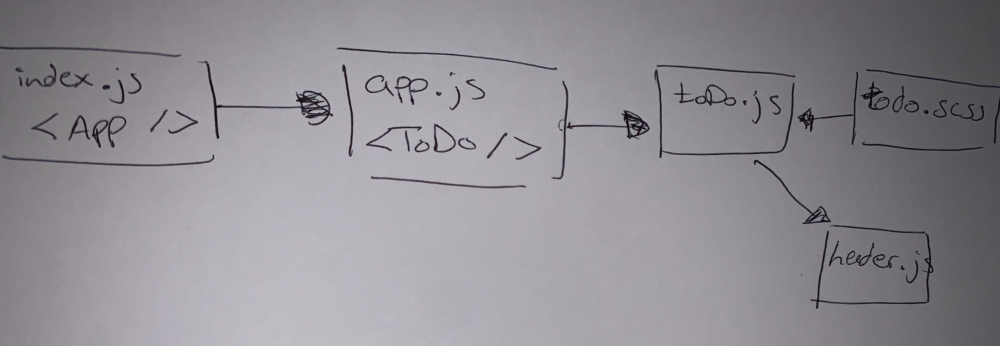

# todo

# LAB 
  - Class 31

# Author
  - Amal Almomani

# Links and Resources
  - submission PR 
    - 
  - ci/cd (GitHub Actions)

# Setup
  - npm i

# How to initialize/run your application (where applicable)
  - npm run start

# Tests
  - npm test

# UML
  - 
